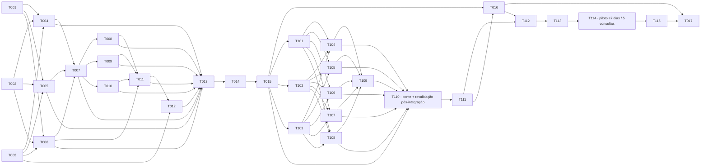

# Review Request — Plan Gate consolidado SPEC-0001 + SPEC-0002

## Identidade e estado

| Campo | Valor |
| --- | --- |
| Unidade | Plano integrado da SPEC-0001 e da SPEC-0002 |
| Estado solicitado | `PRONTO PARA RECONFERÊNCIA DO PLAN GATE` após Review Verdict `CORREÇÕES SOLICITADAS` |
| Resultado de gate | `Plan Gate: Pending` — este pacote não aprova o próprio plano |
| Risco | Alto documental e operacional; a execução futura materializa guardrails transversais e uma ponte com escrita externa escopada |
| Branch | `deco/v0.2` |
| HEAD e upstream observados | `2ff940a3885c020db8b019c23c91fc7c82e45037` em `origin/deco/v0.2`; divergência `0 0` |
| Preflight manual desta autoria | `CONDICIONAL` pelo footprint prévio conhecido; não houve Git Guardian formal, cuja primeira materialização futura pertence à SPEC-0002/T004. O contexto foi relocado de `docs/sessoes/` para `session-context.md` desta rodada |
| Executor do plano | Codex; modelo exposto pela sessão: `gpt-5.6-sol`; effort efetivo e session ID: `NÃO REGISTRADO` |
| Revisor exigido | Instância distinta, inicialmente read-only |
| Data | 2026-09-21 |

## Fontes e nomenclatura

Fontes primárias lidas diretamente por Notion MCP nesta autoria:

- `Potestatem SDD — glossário e política de stacks`, atualizada em 21/09/2026;
- `Decisão — Fluxo SDD repo-first com ponte Notion MCP`, aprovada em 16/09/2026;
- revisão independente original `3e0c76b764a4811fbafccd88e379b016`;
- reconferência aceita `3e1c76b764a481ccaac2fe756352cc39`.

Vocabulário obrigatório deste pacote:

- **Potestatem SDD** é o método organizacional;
- **Specsfy** é o método-base/ferramental upstream atualmente utilizado;
- **Camada Potestatem** reúne regras, skills e guardrails próprios;
- **Tempus OS** é produto que utiliza o método;
- **Camada Deco** é o nome histórico da atual Camada Potestatem;
- `14-SpecsFy-Deco`, `deco/v0.2` e `deco/` permanecem identificadores técnicos provisórios.

Não foi feita substituição global em documentos históricos. A migração dos
identificadores técnicos fica para checkpoint posterior, com plano explícito e
sem autorização implícita neste gate.

## Análise de impacto da política de stacks

| Eixo | Classificação | Tratamento no plano |
| --- | --- | --- |
| Nomenclatura | Mudança conceitual não material | Aplicada somente ao conteúdo novo; requisitos, riscos e gates permanecem |
| Identificadores técnicos | Nenhuma mudança nesta missão | Repo, branch, diretório, slugs e paths atuais são preservados; migração futura recomendada |
| Perfis de risco da SPEC-0002 | Requisito explícito já aprovado | Permanecem os quatro perfis de revisão de FR-006; não são perfis de stack |
| Perfis técnicos de stack | Política organizacional nova, sem requisito de implementação nestas specs | Catálogo universal adiado para spec posterior; o piloto declara contrato Laravel/PostgreSQL local |

Conclusão: não foi encontrada mudança material que exija reabrir o Definition
Gate. A política esclarece identidade e direção futura, sem alterar o escopo
aprovado das duas specs.

## Decisões de plano propostas

1. A SPEC-0002 é a espinha transversal e recebe primeiro Git Guardian, Session
   Guardian, contratos de revisão, cinco skills, Contrato de Entrega e máquina
   de estados.
2. A dependência de DEC-006 é resolvida no plano: como o censo não encontrou
   fonte executável versionada, a primeira materialização do Git Guardian passa
   a ser `T004`, primeira tarefa `[CODE]` depois de `T001`–`T003`. Isso fixa dono e ordem sem
   afirmar que o mecanismo já existe.
3. A SPEC-0001 materializa apenas cockpit, Consulta SDD, Modo B, cópia derivada,
   reconciliação e fronteira MCP; consome o preflight transversal sem duplicá-lo.
4. Contratos executáveis e runtime do consumidor permanecem sem dependência de
   Notion, MCP ou rede.
5. O piloto Tempus Mind Map usa contrato técnico local Laravel/PostgreSQL. Ele
    não prova nem cria dependência do Potestatem SDD em Laravel.
6. A decisão humana de 21/09/2026 confirmou `python3 -B -m unittest` como
   runner TDD da v0.2 (SPEC-0002/DEC-009). Os seis testes Python e seis
   features BDD da camada serão integrados à regressão da raiz; ausência,
   exclusão ou não execução são falhas, mesmo que a suíte restante fique verde.
7. A instalação sintética transversal T015 é baseline, não prova final.
   SPEC-0001/T110 revalida o pacote **depois** de integrar a ponte.
8. O protocolo aprovado do piloto permanece: cinco Consultas SDD completas
   ou sete dias, o que ocorrer depois; `M-1` exatamente 5 e `M-4`/`M-5`
   5 de 5. Cockpit por marco não substitui essas medições.

## Arquivos previstos na execução futura

| Responsabilidade | Caminhos previstos |
| --- | --- |
| Governança transversal | `deco/rules/review-governance.md`, `deco/rules/delivery-contract.md` |
| Skills | `deco/skills/{git-guardian,session-guardian,review-router,review-definition,review-plan,review-delivery,review-handoff}/SKILL.md` |
| Repasse e ponteiros | `deco/templates/review-request.md`, `review-verdict.md`, `correction-report.md`, `delivery-contract.md`, `CURRENT`, `SESSION_CURRENT` |
| Ponte Notion | `deco/rules/notion-repository-bridge.md`, `deco/templates/notion/{cockpit,consulta-sdd,modo-b}.md` |
| Validadores e fixtures | `deco/scripts/validate-*.mjs`, `deco/fixtures/{governance,notion-bridge,consumer}/`, `tests/test_deco_*.py`, `tests/features/deco_*.feature`; T013 também reconcilia `tests/test_references.py` com fixtures negativas |
| Distribuição | `deco/manifest.json`, `deco/README.md`, `deco/scripts/{install,verify}.mjs` |
| Piloto | caminhos reais somente após censo Git read-only do consumidor; arquivos Laravel esperados ficam condicionados a essa evidência |

O contrato técnico local do piloto fica em `acceptance.md` e sua evidência
em `evidence.md` (SPEC-0001). A governança transversal possui
`governance-acceptance.md` e `governance-evidence.md` (SPEC-0002).

## Grafo de dependências

As arestas entre namespaces são pré-condições da ordem integrada:
`T015→T101/T102/T103`, `T015→T110` (revalidação), `T111→T016`,
`T016→T112` e `T115→T017`. `T004` ocorre **após** seus três TDD
transversais. A instalação inicial de T015 jamais substitui o GREEN
pós-integração de T110. A conferência mecânica da rodada verificou todos os
32 IDs, 72 arestas, dependências normativas e ausência de ciclos.

## Três cortes

| Corte | Conteúdo |
| --- | --- |
| **MÍNIMO PILOTÁVEL DA CAMADA POTESTATEM** | SPEC-0002/T001–T016 e SPEC-0001/T101–T114, cada ID uma vez. Inclui T013, T109, T114, testes Python/BDD da raiz, fixtures necessárias, contrato de entrega, pacote, T015 basal e T110 pós-ponte, contrato local e piloto **aberto até sete dias e cinco consultas completas**; cockpit atualizado por marcos, não como métrica substituta |
| **NECESSÁRIO PARA O DELIVERY GATE** | SPEC-0001/T115 e SPEC-0002/T017, cada ID uma vez. Reconciliar M-1 a M-7, reexecutar todos os validadores, raiz Python/BDD, verificação negativa de falso verde, pacote pós-ponte e revisão independente; nenhuma falha do pacote é reclassificada como ambiental |
| **ADIADO PARA DEPOIS DO PILOTO** | Nenhuma tarefa normativa desta v0.2. Catálogo universal de perfis técnicos de stack, renomeação de identificadores, database estruturada de Consultas SDD, custom agent/trigger/worker, automação de escrita normativa, colaboração/realtime e produção pública exigem decisão ou spec posterior |

## Tarefas consolidadas

Os IDs `T0xx` pertencem à SPEC-0002; `T1xx`, à SPEC-0001. Cada tarefa mantém
checklist PREP/EXECUTE/VERIFY/VISUAL/EVIDENCE/IMPROVE na spec correspondente.
Esta tabela é projeção literal dos 32 cabeçalhos normativos das seções 14:
texto, `Refs` e `Depends` não são reinterpretados; RED, saída prevista,
risco e critério acrescentam a leitura de revisão. O corte é único por ID.
Os seis arquivos BDD `tests/features/deco_*.feature` estão explicitados nos
checklists `PREP` das tarefas T001–T003/T101–T103: o validador de tarefas
do Specsfy não reconhece como TDD um cabeçalho que mencione `.feature`.

| ID | Spec | Tarefa normativa e arquivos previstos | Refs normativas | Depends normativo | Teste RED | Saída GREEN prevista | Risco | Critério de conclusão | Paralelismo | Corte |
| --- | --- | --- | --- | --- | --- | --- | --- | --- | --- | --- |
| T001 | 0002 | [TEST] [TDD] Criar testes de contratos transversais em tests/test_deco_governance_contracts.py | US-001, US-002, US-003, US-004, FR-001, FR-002, FR-003, FR-004, FR-005, FR-006, FR-007, FR-008, FR-009, FR-010, FR-011, FR-012, NFR-001, NFR-002, NFR-003, NFR-004, NFR-005, AC-001, AC-002, AC-003, AC-004, AC-005, AC-006, AC-007, AC-008, AC-009, AC-010, AC-011, AC-012, AC-013 | none | contratos ausentes | schemas e rejeições passam | Alto | matriz, roteador, separação e GG cobertos | Não | Mínimo |
| T002 | 0002 | [P] [TEST] [TDD] Criar testes de sessão, rodada e ponteiros em tests/test_deco_governance_rounds.py | US-001, US-002, US-003, US-004, FR-001, FR-002, FR-003, FR-004, FR-005, FR-006, FR-007, FR-008, FR-009, FR-010, FR-011, FR-012, NFR-001, NFR-002, NFR-003, NFR-004, NFR-005, AC-014, AC-015, AC-016, AC-017, AC-018, AC-019, AC-020, AC-021, AC-022, AC-023, AC-024, AC-025, AC-026 | none | estados/ponteiros ausentes | transições e imutabilidade passam | Alto | SG, CURRENT e rodada cobertos | Sim [P] | Mínimo |
| T003 | 0002 | [P] [TEST] [TDD] Criar testes de entrega, evidência e escalonamento em tests/test_deco_governance_delivery.py | US-001, US-002, US-003, US-004, FR-001, FR-002, FR-003, FR-004, FR-005, FR-006, FR-007, FR-008, FR-009, FR-010, FR-011, FR-012, NFR-001, NFR-002, NFR-003, NFR-004, NFR-005, AC-027, AC-028, AC-029, AC-030, AC-031, AC-032, AC-033, AC-034, AC-035, AC-036, AC-037, AC-038 | none | entrega/escalonamento ausentes | estados e gates passam | Alto | entrega, evidência e escalonamento cobertos | Sim [P] | Mínimo |
| T004 | 0002 | [CODE] Materializar Git Guardian em deco/skills/git-guardian/SKILL.md | FR-004, AC-011, AC-012, AC-013, AC-038 | T001, T002, T003 | GG formal inexistente | 16 dimensões e três vereditos validados | Crítico | fail-closed executável e versionado | Não | Mínimo |
| T005 | 0002 | [P] [CODE] Materializar Session Guardian em deco/skills/session-guardian/SKILL.md | FR-005, AC-014, AC-015, AC-016, AC-017, AC-018, AC-019 | T001, T002, T003 | SG e SESSION_CURRENT ausentes | abertura/continuidade/fechamento passam | Alto | nenhum transcript vira fonte | Sim [P] | Mínimo |
| T006 | 0002 | [P] [CODE] Materializar contratos de repasse em deco/templates/review-request.md | FR-007, FR-008, AC-020, AC-021, AC-022, AC-023, AC-024, AC-025, AC-026 | T001, T002, T003 | artefatos/rodadas ausentes | schemas, estados e imutabilidade passam | Alto | contrato de repasse completo | Sim [P] | Mínimo |
| T007 | 0002 | [CODE] Implementar review-router em deco/skills/review-router/SKILL.md | FR-001, FR-002, FR-003, FR-006, AC-001, AC-002, AC-003, AC-004, AC-005, AC-006, AC-007, AC-008, AC-009, AC-010 | T004, T005, T006 | roteamento não executável | gate + perfil correto e proveniência exigida | Alto | quatro riscos e quatro perfis de risco cobertos | Não | Mínimo |
| T008 | 0002 | [P] [CODE] Implementar review-definition em deco/skills/review-definition/SKILL.md | FR-006, AC-004, AC-005, AC-020 | T007 | revisão de definição ausente | contrato do Definition Gate passa | Médio | unidade coerente revisável | Sim [P] | Mínimo |
| T009 | 0002 | [P] [CODE] Implementar review-plan em deco/skills/review-plan/SKILL.md | FR-006, AC-004, AC-005, AC-020 | T007 | revisão de plano ausente | arquitetura/tarefas/rollback/testes cobertos | Alto | Plan Gate não se autoaprova | Sim [P] | Mínimo |
| T010 | 0002 | [P] [CODE] Implementar review-delivery em deco/skills/review-delivery/SKILL.md | FR-006, FR-009, FR-010, FR-011, AC-027, AC-028, AC-029, AC-030, AC-031 | T007 | revisão de entrega ausente | diff/testes/evidências/regressões cobertos | Alto | Delivery Gate exige evidência | Sim [P] | Mínimo |
| T011 | 0002 | [CODE] Implementar review-handoff em deco/skills/review-handoff/SKILL.md | FR-007, FR-008, FR-011, AC-020, AC-021, AC-022, AC-023, AC-024, AC-025, AC-026, AC-035, AC-036, AC-037 | T006, T008, T009, T010 | CURRENT e rodada inválidos | criação/validação/encerramento passam | Alto | repasse imutável e sem ambiguidade | Não | Mínimo |
| T012 | 0002 | [CODE] Materializar Contrato de Entrega em deco/rules/delivery-contract.md | FR-009, FR-010, FR-011, AC-027, AC-028, AC-029, AC-030, AC-031 | T003, T011 | estados colapsados | PRONTO/ENTREGUE/ACEITO e regressões passam | Alto | treze campos e evidência de gate validados | Não | Mínimo |
| T013 | 0002 | [CODE] Integrar validador, fixtures e regressão da raiz em deco/scripts/validate-governance.mjs e tests/test_deco_regression_contract.py | FR-001, FR-003, FR-004, FR-005, FR-007, FR-008, FR-011, FR-012, AC-032, AC-033, AC-034, AC-035, AC-036, AC-037, AC-038 | T004, T005, T006, T007, T008, T009, T010, T011, T012 | suíte da camada ausente, excluída ou não executada | regressão da raiz executa todas as suítes; três negativas saem não zero; fixtures não quebram links reais | Alto | FR-012 sem falso verde e topologia documental verde | Não | Mínimo |
| T014 | 0002 | [CODE] Empacotar e instalar a Camada Potestatem por deco/scripts/install.mjs | FR-004, FR-005, FR-006, FR-007, FR-008, FR-009, FR-010, FR-011, NFR-001, NFR-002, NFR-003, NFR-004, NFR-005 | T013 | instalação/lock inexistentes | dry-run, idempotência, conflito e rollback passam | Alto | pacote distribuível e verificável | Não | Mínimo |
| T015 | 0002 | [OPS] Validar instalação isolada em deco/fixtures/consumer/valid/AGENTS.md | FR-004, FR-005, FR-006, FR-007, FR-008, FR-009, FR-010, FR-011, FR-012, NFR-001, NFR-003, NFR-005 | T014 | consumidor sintético sem instalação verificada | baseline transversal instalada e verificada; ainda não é prova final pós-ponte | Alto | fixture sintética e rollback registrados | Não | Mínimo |
| T016 | 0002 | [DOC] Registrar contrato transversal do piloto em deco/pilots/tempus-mind-map/governance-acceptance.md | FR-001, FR-002, FR-003, FR-004, FR-005, FR-006, FR-007, FR-008, FR-009, FR-010, FR-011, FR-012 | T015 | elegibilidade e protocolo ausentes | contrato transversal registra projeto não crítico, ≥7 dias e cinco consultas completas | Alto | governance-acceptance.md sem redução | Não | Mínimo |
| T017 | 0002 | [DOC] Reconciliar piloto e preparar Delivery Gate em deco/pilots/tempus-mind-map/governance-evidence.md | FR-001, FR-002, FR-003, FR-004, FR-005, FR-006, FR-007, FR-008, FR-009, FR-010, FR-011, FR-012, NFR-001, NFR-002, NFR-003, NFR-004, NFR-005 | T016 | piloto local ou regressão da camada incompletos | cinco consultas, ≥7 dias, suíte da camada e pacote pós-ponte verificados | Crítico | governance-evidence.md e revisão independente | Não | Delivery |
| T101 | 0001 | [TEST] [TDD] Criar testes de contratos e operação offline em tests/test_deco_bridge_contracts.py | US-001, US-002, US-003, FR-001, FR-002, FR-003, FR-004, FR-005, FR-006, FR-007, FR-008, FR-009, FR-010, NFR-001, NFR-002, NFR-003, NFR-004, AC-001, AC-002, AC-003, AC-004, AC-005, AC-006, AC-007, AC-008, AC-009, AC-010 | none | contratos locais ausentes | offline, cockpit e cópia passam | Alto | primeira faixa BDD coberta | Não | Mínimo |
| T102 | 0001 | [P] [TEST] [TDD] Criar testes de segurança e Modo B em tests/test_deco_bridge_safety.py | US-001, US-002, US-003, FR-001, FR-002, FR-003, FR-004, FR-005, FR-006, FR-007, FR-008, FR-009, FR-010, NFR-001, NFR-002, NFR-003, NFR-004, AC-011, AC-012, AC-013, AC-014, AC-015, AC-016, AC-017, AC-018, AC-019, AC-020 | none | limites/Modo B ausentes | segurança e encerramento passam | Crítico | nenhuma escrita fora de escopo | Sim [P] | Mínimo |
| T103 | 0001 | [P] [TEST] [TDD] Criar testes de reconciliação em tests/test_deco_bridge_reconciliation.py | US-001, US-002, US-003, FR-001, FR-002, FR-003, FR-004, FR-005, FR-006, FR-007, FR-008, FR-009, FR-010, NFR-001, NFR-002, NFR-003, NFR-004, AC-021, AC-022, AC-023, AC-024, AC-025, AC-051, AC-052, AC-053 | none | reconciliação ausente | precedência e marco passam | Alto | conflitos materiais bloqueiam | Sim [P] | Mínimo |
| T104 | 0001 | [CODE] Materializar contrato da ponte em deco/rules/notion-repository-bridge.md | FR-003, FR-004, FR-006, FR-009, FR-010, AC-001, AC-003, AC-004, AC-005, AC-014, AC-015, AC-018, AC-020, AC-021, AC-023, AC-024, AC-053 | T101, T102, T103 | runtime depende do Notion | operação offline e cópia derivada passam | Alto | fronteira autoria/runtime explícita | Não | Mínimo |
| T105 | 0001 | [P] [CODE] Materializar cockpit em deco/templates/notion/cockpit.md | FR-001, AC-009, AC-014, AC-017, AC-051 | T101, T102, T103 | campos/gatilhos ausentes | somente marcos atualizam | Médio | cockpit auditável sem diário | Sim [P] | Mínimo |
| T106 | 0001 | [P] [CODE] Materializar Consulta SDD em deco/templates/notion/consulta-sdd.md | FR-002, FR-008, FR-009, FR-010, AC-002, AC-003, AC-013, AC-017, AC-019, AC-020, AC-023, AC-052, AC-053 | T101, T102, T103 | transições e aprovador ausentes | consulta encerra e conflitos bloqueiam | Alto | uma pergunta, um esclarecimento máximo | Sim [P] | Mínimo |
| T107 | 0001 | [CODE] Materializar fronteira MCP em deco/rules/notion-mcp-boundary.md | FR-005, AC-006, AC-007, AC-012, AC-022, AC-025 | T101, T102, T103 | escopo MCP não auditável | testes negativos recusam fora da subárvore | Crítico | PII/segredo e irreversíveis vedados | Não | Mínimo |
| T108 | 0001 | [P] [CODE] Materializar relatório Modo B em deco/templates/notion/modo-b.md | FR-007, AC-011, AC-012, AC-016, AC-051 | T101, T102, T103 | fato/inferência misturados | três classes e aplicação rastreável passam | Alto | parecer não vira autorização | Sim [P] | Mínimo |
| T109 | 0001 | [CODE] Criar validador e fixtures em deco/scripts/validate-notion-bridge.mjs | FR-001, FR-002, FR-003, FR-004, FR-005, FR-006, FR-007, FR-008, FR-009, FR-010, AC-001, AC-002, AC-003, AC-004, AC-005, AC-006, AC-007, AC-008, AC-009, AC-010, AC-011, AC-012, AC-013, AC-014, AC-015, AC-016, AC-017, AC-018, AC-019, AC-020, AC-021, AC-022, AC-023, AC-024, AC-025, AC-051, AC-052, AC-053 | T104, T105, T106, T107, T108 | nome de interface ausente/divergente/extra | comparação exata 6/6, negativos, offline e reconciliação passam | Alto | validador e matriz de seis nomes reproduzíveis | Não | Mínimo |
| T110 | 0001 | [CODE] Integrar a ponte ao pacote e revalidar instalação em deco/manifest.json | FR-001, FR-002, FR-003, FR-004, FR-005, FR-006, FR-007, FR-008, FR-009, FR-010, NFR-001, NFR-002, NFR-003, NFR-004 | T104, T105, T106, T107, T108, T109 | instalação antes da ponte não prova pacote final | reinstalação pós-ponte, idempotência, conflito, rollback e runtime offline passam | Alto | prova posterior a T109 e T015 | Não | Mínimo |
| T111 | 0001 | [OPS] Executar censo do consumidor e registrar em deco/pilots/tempus-mind-map/acceptance.md | FR-005, FR-006, FR-008, NFR-002, NFR-003 | T110 | baseline consumidor desconhecida | censo read-only e elegibilidade não crítica confirmados | Alto | LionCode preservado; sem cliente ativo ou legado | Não | Mínimo |
| T112 | 0001 | [DOC] Fixar fatia Laravel e isolamento em deco/pilots/tempus-mind-map/acceptance.md | FR-005, FR-008, NFR-002, NFR-003, AC-007, AC-013, AC-017, AC-025, AC-052 | T111 | autenticação/isolamento ausentes | sete campos de decisão de stack registrados; isolamento testável | Crítico | contrato Laravel local sem catálogo universal | Não | Mínimo |
| T113 | 0001 | [DOC] Fixar mutações e exportação em deco/pilots/tempus-mind-map/acceptance.md | FR-004, FR-009, FR-010, NFR-002, AC-015, AC-019, AC-021, AC-023, AC-024, AC-053 | T112 | mutação/exportação ausentes | criar/renomear/mover, auditoria e JSON passam | Alto | fatia funcional aceita sem reduzir protocolo de piloto | Não | Mínimo |
| T114 | 0001 | [OPS] Executar piloto medido e atualizações de cockpit por marco em deco/pilots/tempus-mind-map/evidence.md | FR-001, FR-002, FR-005, FR-007, FR-008, FR-009, FR-010, NFR-002, NFR-003, AC-009, AC-011, AC-012, AC-016, AC-017, AC-019, AC-020, AC-022, AC-025, AC-051, AC-052, AC-053 | T113 | menos de 5 consultas ou menos de 7 dias | M-1 exatamente 5; M-4/M-5 5 de 5; janela ≥7 dias; cockpit por marco | Alto | piloto permanece aberto até ambos limiares | Não | Mínimo |
| T115 | 0001 | [DOC] Reconciliar pós-piloto e preparar Delivery Gate em deco/pilots/tempus-mind-map/evidence.md | FR-001, FR-002, FR-003, FR-004, FR-005, FR-006, FR-007, FR-008, FR-009, FR-010, NFR-001, NFR-002, NFR-003, NFR-004, AC-001, AC-002, AC-003, AC-004, AC-005, AC-006, AC-007, AC-008, AC-009, AC-010, AC-011, AC-012, AC-013, AC-014, AC-015, AC-016, AC-017, AC-018, AC-019, AC-020, AC-021, AC-022, AC-023, AC-024, AC-025, AC-051, AC-052, AC-053 | T114 | divergências não classificadas | M-1 a M-7 medidos e evidência local reconciliada | Alto | evidence.md local entregue à SPEC-0002/T017 | Não | Delivery |

## Piloto consumidor

**Produto:** Tempus Mind Map. **Papel:** primeiro piloto consumidor do Potestatem
SDD e da Camada Potestatem.

- Stack inicial: Laravel moderno, PostgreSQL preferencial e contrato técnico
  local; isso não cria dependência do método em Laravel.
- Preservação: baseline LionCode mantida, branch própria e nenhum reaproveitamento
  antes de censo Git read-only; T111 certifica projeto não crítico, nunca o
  legado nem projeto com cliente ativo.
- Escopo máximo: autenticação; ownership entre dois usuários; mapa e nós; criar,
  renomear e mover nó; mutação transacional com auditoria; exportação JSON;
  testes; cockpit por MCP nos gatilhos de marco; Git Guardian, revisão e handoff.
- Decisão de stack local (T112): registrar tipo de produto, restrições, chassi
  disponível, competência operacional, testes, deploy e custo de manutenção;
  Laravel/PostgreSQL são direção local, não perfil técnico universal.
- Protocolo: **cinco Consultas SDD completas ou sete dias, o que ocorrer depois**.
  Manter o piloto aberto até os dois limiares; `M-1` exatamente 5,
  `M-4`/`M-5` 5 de 5 e `M-2` pelo menos 3 de 5. Uma atualização do
  cockpit nunca substitui a medição.
- Fora: colaboração, realtime, comentários, anexos, IA, billing, mobile,
  paridade MindMeister e produção pública.
- Meta de engenharia: entregar a fatia funcional com escopo contido, cortando
  acabamento e funcionalidades opcionais se necessário; nunca testes,
  isolamento, auditoria ou revisão. A janela experimental mínima continua
  **sete dias**, ainda que a implementação termine antes.

## Estimativa

| Faixa | Horas de execução com IA |
| --- | ---: |
| Governança transversal e TDD | 32–42 h |
| Ponte, segurança MCP e integração | 20–28 h |
| Empacotamento e instalação | 10–14 h |
| Piloto Tempus Mind Map — engenharia e operação ativa | 16–24 h, distribuídas em pelo menos sete dias de calendário e cinco consultas completas |
| Reconciliação, regressão e Delivery Gate | 8–12 h |
| Correções após revisão independente | 4–6 h |
| **Total** | **90–126 h de execução com IA; duração de calendário mínima de sete dias após início do piloto** |

## Riscos e rollback

| Risco | Proteção | Rollback planejado |
| --- | --- | --- |
| Git Guardian falso-verde | fail-closed, fixtures e separação observado/inferido | abortar operação e preservar worktree; nunca limpar automaticamente |
| CURRENT/SESSION_CURRENT ambíguos | namespaces, exatamente um alvo e rodadas imutáveis | restaurar ponteiro anterior validado; preservar rodada histórica |
| Escrita MCP fora de escopo | allowlist por subárvore, preflight e teste negativo sintético | não gravar; se houve escrita reversível, restaurar valor anterior e registrar ocorrência |
| Instalador sobrescrever customização | lock, hash, dry-run, backup e conflito explícito | restaurar backup validado; sem `clean`/`reset` |
| Piloto vazar dados entre usuários | políticas de ownership, transação e testes negativos | interromper piloto, invalidar amostra sintética e corrigir antes de continuar |
| Fatia funcional exceder orçamento de engenharia | corte de acabamento e opcionais, mantendo janela experimental | remover opcionais; nunca reduzir sete dias, cinco consultas, testes, isolamento, auditoria ou revisão |
| Regressão da raiz omitir a camada | T013/T109 inventariam suítes Python/BDD; T017 exige prova de execução e negativas de ausência/exclusão/não execução | não fechar Delivery Gate; restaurar descoberta, repetir regressão e manter evidência do RED |
| Fixture negativa quebrar verificação de links | T013 reconcilia `tests/test_references.py` sem mascarar link real | manter falha visível e fixture sintética isolada até GREEN |
| Nomenclatura induzir rename prematuro | identificadores congelados nesta missão | manter nomes técnicos atuais e abrir plano futuro separado |

## Decisões humanas necessárias

1. No Plan Gate, aceitar ou rejeitar a recomendação única de a SPEC-0002 assumir
   a primeira materialização do Git Guardian.
2. Aprovar o Plan Gate somente após revisão independente; este autor não pode
   fazê-lo.
3. Antes do piloto, confirmar o repositório consumidor e a branch após o censo
   read-only. Nenhum acesso ao Tempus Mind Map foi feito nesta missão.
4. Após o piloto, decidir se os contratos são promovidos a
   `deco/rules/canonical.md` e se começa uma spec separada de perfis técnicos.
5. Runner TDD e protocolo do piloto **já foram decididos** nesta rodada
   humana: `unittest` e cinco consultas completas ou sete dias, o que
   ocorrer depois. Não são perguntas pendentes do Plan Gate.

## Testes e evidências previstos

- três predecessores TDD por spec em `tests/test_deco_*.py`, com
  `tests/features/deco_*.feature`, cobrindo todos os US/FR/NFR e todos os AC;
- validadores focais de governança, ponte, manifest, instalação e interfaces;
- fixtures positivas e negativas para ponteiros, proveniência, conflitos,
  permissão MCP, separação executor/aprovador e estados de entrega;
- regressão da raiz: `python3 -B -m unittest discover -s tests -p
  'test_*.py'`, Behave e `make verify-version`; guarda de execução da
  camada falha se um teste Python/BDD estiver ausente, excluído ou não
  executado;
- teste real do piloto limitado a dados sintéticos e sem produção pública,
  medido por `M-1` a `M-7` durante ao menos sete dias e exatamente cinco
  consultas completas; cockpit atualizado por marco.

## Validação executada nesta rodada de correção

- `validate_tasks.mjs ... --allow-draft --json`: SPEC-0001 com 15 tarefas,
  três TDD, 90 itens e 45/45 IDs; SPEC-0002 com 17 tarefas, três TDD,
  102 itens e 59/59 IDs. Cada execução retorna **um** erro de caminho:
  `.agents/skills/specsfy-07-implement/scripts/verify_evidence.mjs`
  exigido pelo validador, enquanto o monorepo mantém o script em `skills/`.
  Sem `--allow-draft`, há também o erro esperado de Plan Gate `Pending`;
  portanto são **dois** erros no modo estrito, não um.
- `validate_interface_tasks.mjs`: `Interface nas tarefas: OK` em ambas.
- `validate_spec.mjs ... --allow-draft`: ambas continuam `NOT READY`
  exclusivamente pelo falso positivo conhecido da regex de marcador, que
  casa a palavra portuguesa isolada `todo` e, em alguns casos, parte de
  `método`. Não houve supressão do vocabulário para forçar verde.
- `python3 -B -m unittest discover -s tests -p 'test_*.py'`: 111 testes;
  **6 falhas e 3 erros** após a relocação do contexto. As duas falhas
  introduzidas por `docs/sessoes/` foram tratadas como falhas do pacote e
  os testes focais de topologia e alcance do portal passaram. O baseline
  remanescente inclui falhas do módulo `deco/` em logo/links; T013 possui a
  reconciliação de fixtures negativas. Falhas de ferramentas de ebook,
  template e remoto do fork foram mantidas como limitações ambientais.
- `uv run --quiet --with behave behave tests/features --no-capture`:
  não iniciou porque `uv` está ausente (exit 127). O fallback
  `python3 -B -m behave tests/features --no-capture` também falhou
  (`No module named behave`, exit 1); nenhuma prova BDD foi
  reivindicada. `make verify-version`: exit 0, `0.22.2`.
- `node skills/specsfy-06-tdd-bdd/scripts/check_traceability.mjs
  deco/specs/0001-ponte-notion-repositorio/spec.md tests --json --full-chain`:
  exit 1, 22/45 IDs em testes preexistentes e 45 cadeias incompletas;
  equivalente para `0002-governanca-sdd/spec.md`: exit 1, 25/59 e
  59 cadeias incompletas. É RED deliberado, não validação verde.
- Conferência mecânica entre fonte normativa, tabela, grafo e cortes:
  **32/32 tarefas, 32/32 nós, 72 arestas, zero fantasmas, zero
  predecessores ausentes, zero ciclos**. O comando e os resultados
  reproduzíveis constam do Correction Report.
- Testes RED e evidências GREEN da Camada Potestatem **não foram criados**,
  conforme a vedação de implementação. Os negativos de ausência/exclusão/não
  execução são tarefa futura T013/T017, não prova já executada.

## Itens deliberadamente adiados

Catálogo universal de perfis técnicos; rename de repo/branch/diretório/spec;
database estruturada de consultas; automação Notion; produção pública; escopo
funcional excedente do piloto. A ausência do catálogo universal é explícita e
não foi mascarada pelos quatro perfis de risco já exigidos pela SPEC-0002.

## Pedido ao revisor

Verificar a unidade consolidada, registrar `Review Verdict` com achados
priorizados e não alterar arquivos. O veredito deve distinguir
`APROVADO | CORREÇÕES SOLICITADAS | BLOQUEADO` e não deve marcar o Plan Gate.
